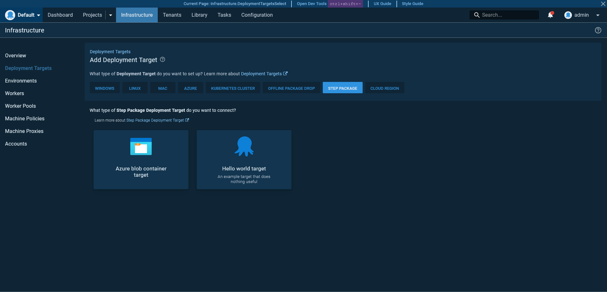
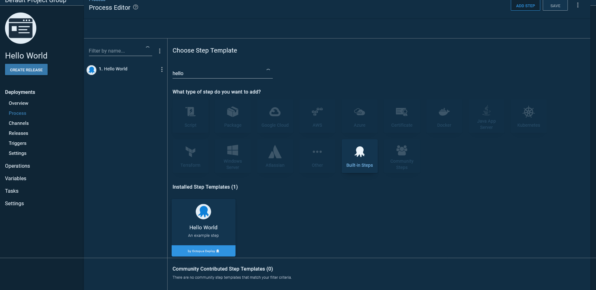
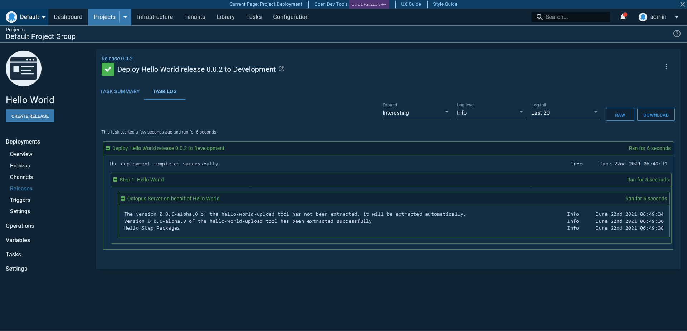

Step packages are an evolution in the development of Octopus steps. [Step packages address many of the concerns](https://github.com/OctopusDeploy/Architecture/tree/main/Steps) that made it difficult to implement new functionality as Octopus scaled up in terms of internal team size and external surface area. In particular, step packages are:

* Developed outside the main Octopus code base.
* Tested as isolated and independent projects.
* Distributed on their own independent timelines (not quite implemented yet).
* Independently versioned, with each version able to be run side-by-side (not implemented yet).

This sample project provides a starting point for anyone looking to create a new step package. The code in this repository defines a "Hello World" target and step demonstrating a minimal step package implementation.

## Project directory structure

The directory structure of a step package is shown below:

* `\`
  * `steps` - A directory containing one or more step definitions.
    * `<step-name>` - A directory containing the definition of a step. There may be many of these directories defining many steps within a single step package.
      * `src` - The parent directory containing the step code and assets.
        * `__tests__` - The directory containing step tests.
          * `executor.spec.ts` - Tests validating the logic in the `executor.ts` file.
        * `executor.ts` - The code to be executed when a step is run by Octopus.
        * `inputs.ts` - The definition of the inputs required by the step.
        * `logo.svg` - The image to be displayed in the Octopus web UI for the step.
        * `metadata.json` - The step metadata.
        * `ui.ts` - The step UI definition.
        * `validation.ts` - The step validation rules.
  * `targets` - A directory containing one or more target definitions.
    * `<target-name>` - A directory containing the definition of a target. There may be many of these directories defining many steps within a single step package.
      * `src` - The parent directory containing the target code and assets.
        * `__tests__` - The directory containing target tests.
          * `executor.spec.ts` - Tests validating the logic in the `executor.ts` file.
        * `executor.ts` - The code to be executed when a target health check is run by Octopus.
        * `inputs.ts` - The definition of the inputs required by the target.
        * `logo.svg` - The image to be displayed in the Octopus web UI for the target.
        * `metadata.json` - The target metadata.
        * `ui.ts` - The target UI definition.
        * `validation.ts` - The target validation rules.
  * `.eslintignore` - The [ESLint ignore file](https://eslint.org/docs/user-guide/configuring/ignoring-code#the-eslintignore-file).
  * `.eslintrc.js` - The [ESLint configuration file](https://eslint.org/docs/user-guide/configuring/).
  * `.gitignore` - The [git ignore file](https://git-scm.com/docs/gitignore).
  * `.prettierrc` - The [prettier configuration file](https://prettier.io/docs/en/configuration.html).
  * `global.d.ts` - The [TypeScript global libraries](https://www.typescriptlang.org/docs/handbook/declaration-files/templates/global-d-ts.html).
  * `package.json` - The [Node.js project file](https://nodejs.org/en/knowledge/getting-started/npm/what-is-the-file-package-json/).
  * `package-lock.json` - The [specific package versions](https://docs.npmjs.com/cli/v7/configuring-npm/package-lock-json) to be retrieved by npm.
  * `tsconfig.json` - The [TypeScript compiler options file](https://www.typescriptlang.org/docs/handbook/tsconfig-json.html).

## Creating a new target

Creating a new target involves creating the following files under the `targets/<target-name>-target/src` directory. In the case of this sample step package, we'll create them under `targets/hello-world-target/src`:

* `metadata.json`
* `inputs.ts`
* `executor.js`
* `ui.ts`
* `validation.ts`

### `metadata.json`

The `metadata.json` file provides details about the target. A sample is shown below:

```json
{
  "schemaVersion": "1.0.0",
  "version": "0.0.0",
  "type": "deployment-target",
  "id": "hello-world-target",
  "name": "Hello world target",
  "description": "An example target that does nothing useful",
  "categories": [
    "Linux"
  ],
  "launcher": "node"
}
```

* `schemaVersion` is the version of the metadata file. `1.0.0` is the only version available.
* `version` is the version of the target. Versioning is covered in detail [here](https://github.com/OctopusDeploy/Architecture/blob/main/Steps/Concepts/Versioning.md).
* `type` defines the type of resource to be created. It must be `deployment-target` for a target.
* `id` is the resource ID.
* `name` is the name of the target displayed by the Octopus web UI.
* `description` is the description of the target displayed by the Octopus UI.
* `categories` is an array containing one or more target categories display by the Octopus UI where the target will be listed.
* `launcher` defines how the step is executed. A value of `node` means the step is executed by Node.js.

### `inputs.ts`

The `inputs.ts` file exports an interface defining the input fields required by the target. This interface is consumed by `executor.ts` to read the values when performing the target's health check, `ui.ts` to build up the form exposed in the Octopus web UI, and `validate.ts` to verify new values.

An example is shown below exposing a single string field:

```typescript
export default interface HelloWorldTargetInputs {
    greetingPrefix: string;
}
```

### `executor.ts`

Targets perform a health check to validate their inputs and check the state of the system they represent. This health check is performed by the function exported by the `executor.ts` file.

The example below prints some text to the log during a health check, and will always pass, meaning the target is always healthy:

```typescript
import { Handler } from "@octopusdeploy/step-api";
import HelloWorldTargetInputs from "./inputs";

const HelloWorldDeploymentTargetHealthCheckExecutor: Handler<HelloWorldTargetInputs> = async (_, context) => {
    context.print("Hello world target is healthy");
};

export default HelloWorldDeploymentTargetHealthCheckExecutor;
```

### `ui.ts`

The form displayed by the Octopus web UI is defined by the function exported by the `ui.ts` file. The form is defined as an instance of the `DeploymentTargetUI` interface, which has two functions: `createInitialInputs` and `editInputsForm`.

The `createInitialInputs` function allows the initial default field values to be defined.

The `editInputsForm` function provides a DSL for building the user interface. The first parameter is the inputs defined in `inputs.ts`. The second parameter is an instance of `AvailableDeploymentTargetComponents`, which has factory functions for creating various input widgets like text fields, lists, radio buttons etc.

Here we define the initial value of the `greetingPrefix` input to be `Hello`, and build the form with a single `text` input:

```typescript
import { DeploymentTargetUI } from "@octopusdeploy/step-api";
import HelloWorldTargetInputs from "./inputs";

export const HelloWorldTargetUI: DeploymentTargetUI<HelloWorldTargetInputs> = {
    createInitialInputs: () => {
        return {
            greetingPrefix: "Hello"
        };
    },
    editInputsForm: (inputs, { section, text }) => [
        section({
            title: "Greeting",
            content: [
                text({
                    input: inputs.greetingPrefix,
                    label: "Greeting Prefix",
                    helpText: "The beginning of the greeting",
                }),
            ],
        }),
    ],
};

export default HelloWorldTargetUI;
```

### `validation.ts`

Form validation is performed by the function exported by the `validate.ts` file. This function returns an array of `ValueValidator` objects, and takes two parameters:
1. The step inputs as [input paths](https://github.com/OctopusDeploy/Architecture/blob/main/Steps/Concepts/InputsAndOutputs.md#input-paths).
2. A validation function that returns a `ValueValidator` and takes two parameters:
   1. An input path.
   2. A function returning a string containing the error code (or returns nothing if there is no validation error) and takes the input value (retrieved from the input path) as the first parameter.

Here is an example:

```typescript
import { ValidateInputs } from "@octopusdeploy/step-api";
import HelloWorldTargetInputs from "./inputs";

const validateInputs: ValidateInputs<HelloWorldTargetInputs> = (inputs, validate) => {
    return [
        validate(inputs.greetingPrefix, (greeting) => {
            if (greeting === "") return "Greeting can not be empty";
        }),
    ];
};
export default validateInputs;
```

## Creating a new step

Creating a new step involves creating the following files under the `steps/<step-name>/src` directory. In the case of this sample step package, we'll create them under `steps/hello-world/src`:

* `metadata.json`
* `inputs.ts`
* `executor.js`
* `ui.ts`
* `validation.ts`

### `metadata.json`

The `metadata.json` provides details about the step. A sample is shown below:

```json
{
  "schemaVersion": "1.0.0",
  "version": "0.0.0",
  "type": "step",
  "id": "hello-world-upload",
  "name": "Hello World",
  "description": "An example step",
  "categories": [
    "BuiltInStep"
  ],
  "canRunOnDeploymentTarget": false,
  "launcher": "node"
}
```

The following fields make up this file:

* `schemaVersion` is the version of the metadata file. `1.0.0` is the only version available.
* `version` is the version of the step. Versioning is covered in detail [here](https://github.com/OctopusDeploy/Architecture/blob/main/Steps/Concepts/Versioning.md).
* `type` defines the type of resource tobe created. Valid values are `step` and `deployment-target`.
* `id` is the resource ID.
* `name` is the name of the step displayed by the Octopus web UI.
* `description` is the description of the step displayed by the Octopus UI.
* `categories` is an array containing one or more step categories display by the Octopus UI where the step will be listed.
* `canRunOnDeploymentTarget` can be set to `true` to run the step on a target accessible via a tentacle, or `false` to be run on a worker.
* `launcher` defines how the step is executed. A value of `node` means the step is executed by Node.js.

### `inputs.ts`

This file performs the same function as it does when defining a new target.

An example is shown below exposing a single string field:

```typescript
export default interface HelloWorldStepInputs {
  name: string;
}
```

### `executor.ts`

The `executor.ts` file contains the logic to be executed when the step is run as part of a deployment process. 

Unlike the function returned by the target `executor.ts` function, a step `executor.ts` function can receive inputs from both the step and the target. The combination of the inputs defined by these two resources allows a step executor to perform a common action on multiple targets.

For this example we print the greeting defined in the target and the name defined on the step to the output log:

```typescript
import HelloWorldStepInputs from "./inputs";
import {ExecutionInputs, Handler, OctopusContext, TargetInputs} from "@octopusdeploy/step-api";
import HelloWorldTargetInputs from "../../targets/hello-world-target/inputs";

const HelloWorldStepExecutor: Handler<HelloWorldStepInputs, HelloWorldTargetInputs> = async (
    inputs: ExecutionInputs<HelloWorldStepInputs>,
    target: TargetInputs<HelloWorldTargetInputs>,
    context: OctopusContext
) => {
    context.print(target.greetingPrefix + " " + inputs.name);
};

export default HelloWorldStepExecutor;
```

### `ui.ts`

The step form displayed by the Octopus web UI is defined much the same as it was with the target. There are some subtle differences though: 
* It implements the `StepUI` type. 
* The first parameter to the `createInitialInputs` function can be an instance of `InitialInputFactories`, which provides the ability to create blank package references.
* The second parameter to the `editInputsForm` function is an instance of `AvailableStepComponents`, which exposes a different widget set.

Here we define the initial value of the `name` input to be a blank string, and build the form with a single `text` input:

```typescript
import { StepUI } from "@octopusdeploy/step-api";
import HelloWorldStepInputs from "./inputs";

export const HelloWorldStepUI: StepUI<HelloWorldStepInputs> = {
  createInitialInputs: () => {
    return {
      name: ""
    };
  },
  editInputsForm: (inputs, { text }) => {
    return [
      text({
        input: inputs.name,
        label: "Greeting Name",
        helpText: `The name of the person to greet.`,
      }),

    ];
  },
};

export default HelloWorldStepUI;
```

### `validation.ts`

Step form validation is identical to target form validation:

```typescript
import { ValidateInputs } from "@octopusdeploy/step-api";
import HelloWorldStepInputs from "./inputs";

const validateInputs: ValidateInputs<HelloWorldStepInputs> = (inputs, validate) => {
  return [
    validate(inputs.name, (name) => {
      if (name === "") return "Name can not be empty";
    }),
  ];
};
export default validateInputs;
```

## Building the step package

To build step packages, run the following commands:

1. `npm install`
2. `npm run build`
3. `npm run test`

The step package files are saved under the `dist/steps` folder. Add the contents of this folder to a ZIP file and copy it to the `steps` folder in Octopus.

If you are testing with a locally built copy of Octopus, place the ZIP file in `\source\Octopus.Server\bin\net5.0\steps`.

## GitHub workflows

This repository contains a [GitHub workflow](https://github.com/OctopusSamples/StepPackage-HelloWorld/blob/main/.github/workflows/main.yml) that builds and tests the code, packages the resulting files, and creates a release with the step package archive.

Use git tags to indicate releases, while commits to the `main` branch create `alpha` releases.

## Using the step package

With the step package copied to the `steps` directory, target can now be selected when creating a new deployment target: 



The step is available when building a deployment project:



Here is the result of a deployment with the new step package:


